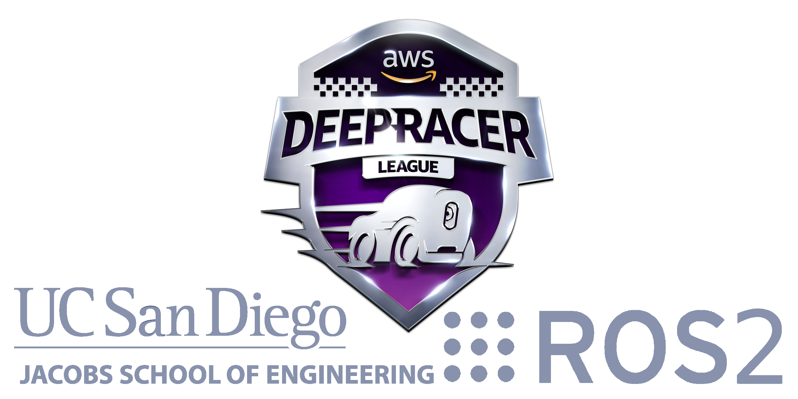

# **ucsd_robo_car_aws_deepracer**

### A simple ROS2 package using OpenCV on aws deepracer rc car with ackerman steering that can follow a line or stay between two lines.

#### AWS Deepracer ROS2 Demo

## **Table of Contents**

  - [**Environment Configuration**](#environment-configuration)
    - [Create a gitlab account](#1-create-a-gitlab-account)
    - [Access this repository](#2-access-this-repository)
    - [Enable X11 forwarding](#enable-x11-forwarding)
  - [**Work Flow To Use This Repository**](#work-flow-to-use-this-repository)
  - [**Nodes**](#nodes)
    - [deepracer_calibration_node](#deepracer_calibration_node)
    - [lane_detection_node](#lane_detection_node)
    - [lane_guidance_node](#lane_guidance_node)
  - [**Topics**](#topics)
    - [ctrl_pkg/servo_msg](#ctrl_pkg-servo_msg)
    - [camera_pkg/display_mjpeg](#camera_pkg-display_mjpeg)
    - [centroid](#centroid)
  - [**Launch**](#launch)
    - [aws_rosracer.launch](#aws_rosracerlaunch)
  - [**Demonstration videos**](#demonstration-videos)
    - [Number of lines to detect](#number-of-lines-to-detect)
    - [Error threshold](#error-threshold)
    - [Blue color detection](#blue-color-detection)
    - [Yellow color detection and line width specification](#yellow-color-detection-and-line-width-specification)
    - [Throttle and steering](#throttle-and-steering)
    - [Manipulating image dimensions](#manipulating-image-dimensions)
    - [Lane detection example with yellow filter](#lane-detection-example-with-yellow-filter)

## **Environment Configuration**

**NOTE: all text that are in boxes like `this` are to be entered into the _terminal window_**

#### **1. Create a gitlab account**

**NOTE: This step is optional/recommended**

  a. Follow steps found here <a href="https://about.gitlab.com/free-trial/" >here</a>

#### **2. Access this repository**

  **NOTE: (if step 1 was not completed, skip steps 2.a-c and choose option 2 under step 2d**

  **a. Generate an SSH key and provide it to Gitlab for access to repositories**

   `ssh-keygen # Use all defaults`

  **b. Then press enter until you get to an empty comand line, then**

   `cat $HOME/.ssh/id_rsa.pub`

  **c. Then copy the ssh key and go back to Gitlab. Click on your user profile at the top right corner of the screen then**
     
  **click on _preferences_ from the drop down menu. Now a new panel on the left hand side of the screen wil apear, click on _SSH Keys_,**
     
  **then paste your SSH key into the text field and submit it.**

  **d. Create ROS workspace and obtain copy of ucsd_robo_car_simple_ros repository**
   
   `cd`

   `mkdir projects && cd projects`

   `mkdir deepracer_ws && cd deepracer_ws`

   `mkdir src && cd src`

  **e. Clone this repository with either of the following options:**

   option 1
   `git clone git@gitlab.com:djnighti/ucsd_robo_car_aws_deepracer.git`

   or (if you have not setup your own gitlab account and an ssh key)

   option 2
   `git clone https://gitlab.com/djnighti/ucsd_robo_car_aws_deepracer.git`

  **f. Add some lines of code to the bash script so that every time a new terminal is opened, root user is activated, builds this ROS2 package and sources all the correct ROS2 setups/variables and the pre-built deepracer ROS2 library**

  First for the **deepracer** user bashrc, enter the following into the terminal:
   
   `nano ~/.bashrc`
  
  add the following line of code at the end of the bash script as the **deepracer** user

   `sudo su`

  Then press 
   
   **ctrl-x** 
   
   Then press 
   
   **y**  (yes) 
   
   and then press 
   
   **enter** 
   
   to save an quit

  Now open a new terminal or restart current terminal

  Now the **root** user bashrc, enter the following into the terminal:

   `cd`

   `nano ~/.bashrc`

   add the following lines of code at the end of the bash script as the **root** user

   `cd`

   `xauth merge /home/deepracer/.Xauthority` (This is for ssh tunneling cv2 windows)

   `source /opt/ros/foxy/setup.bash`

   `source /opt/intel/openvino_2021/bin/setupvars.sh`

   `cd /home/deepracer/projects/deepracer_ws`

   `colcon build`

   `source install/setup.bash`

   `source /opt/aws/deepracer/lib/setup.bash`

   Then press 
   
   **ctrl-x** 
   
   Then press 
   
   **y**  (yes) 
   
   and then press 
   
   **enter** 
   
   to save an quit

  Now open a new terminal or restart current terminal to begin! Proceed to the following section to see the [**Work Flow To Use This Repository**](#work-flow-to-use-this-repository)

  **i. (ONLY DO THIS AS NEEDED) Now as this remote repository is updated, enter the following commands to update the local repository on the deepracer:**
   
   `cd`

   `cd projects/deepracer_ws/src/ucsd_robo_car_aws_deepracer`
   
   `git stash`

   `git pull`

   `chmod -R 777 .`

## **Enable X11 forwarding**

Associated file: **x11_forwarding_steps.txt**

Some deepracers did not have this enabled, so if needed please read the steps in this file to setup X11 forwarding

## **Work Flow To Use This Repository**

  **NOTE: To exit any of the programs, in the terminal press the following 2 keys:**

  **ctrl-c**

1. Calibrate the camera, throttle and steering values using the [**deepracer_calibration_node**](#deepracer_calibration_node)

`ros2 run ucsd_robo_car_aws_deepracer deepracer_calibration_node`

2. Launch the aws racer 

`ros2 launch ucsd_robo_car_aws_deepracer aws_rosracer.launch.py`

3. Tune parameters in step 1 until desired behvior is achieved

## **Nodes**

#### **deepracer_calibration_node**

Associated file: **deepracer_calibration_node.py**

Calibrate the camera, throttle and steering using [deepracer_calibration_node](#deepracer_calibration_node). Use the sliders to find:
- the right color filter 
- desired image dimmensions
- throttle values for both the optimal condtion (error = 0) and the non optimal condtion (error !=0) AKA go fast when error=0 and go slow if error !=0
- steering sensitivty change the Kp value to adjust the steering sensitivty (as Kp --> 1 steering more responsive, as Kp --> 0  steering less responsive) 

These values are saved automatically to a configuration file, so just press control-c when the deepracer is calibrated. Below is the command to begin the calibration process.

`ros2 run ucsd_robo_car_aws_deepracer deepracer_calibration_node`

#### **lane_detection_node**

Associated file: **lane_detection.py**

This node subscribes from [**camera_pkg/display_mjpeg**](#camera_pkg/display_mjpeg) topic and uses opencv to identify line
information from the image, and publish the information of the lines centroid to the [**centroid**](#centroid). 

The color scheme is defined as follows:

- 2 contours : green bounding boxes and a blue average centroid
- 1 contour : green bounding box with a single red centroid

**Note: The cv windows have been commented out so that no errors occur when running in headless mode. For debugging, its suggested to uncomment these lines.**

#### **lane_guidance_node**

Associated file: lane_guidance.py

This node subscribes to the centroid topic, calculates the throttle and steering
based on the centroid value, and then publish them to their corresponding topics.
Throttle is based on whether or not a centroid exists - car goes faster when centroid is present and slows down when there is none.
Steering is based on a proportional controller implemented by the calculating the error between the centroid found in [**line_detection_node**](#line_detection_node) or [**lane_detection_node**](#lane_detection_node) and the heading of the car. 

## **Topics**

#### **ctrl_pkg / servo_msg**
| Name       | Msg Type              | Info                                                       |
| ---------- | --------------------- | ---------------------------------------------------------- |
| /ctrl_pkg/servo_msg   | deepracer_interfaces_pkg.msg.ServoCtrlMsg  | Two Float values each from -1 to 1 for controlling throttle and steering | 

Useful command to stop vehicle:

`ros2 topic pub ctrl_pkg/servo_msg deepracer_interfaces_pkg/msg/ServoCtrlMsg "{angle: 0.0, throttle: 0.0}"`

#### **camera_pkg / display_mjpeg**
| Name       | Msg Type              | Info                                                       |
| ---------- | --------------------- | ---------------------------------------------------------- |
| /camera_pkg/display_mjpeg | sensor_msgs.msg.Image | Image last read from USB camera image                      |

Useful command to troubleshoot camera:

`ros2 topic echo /camera_pkg/display_mjpeg`

#### **centroid**
| Name       | Msg Type              | Info                                                       |
| ---------- | --------------------- | ---------------------------------------------------------- |
| /centroid   | std_msgs.msg.Float32    | Float value for that represents the error of the x coordinate of centroid in camera image space |

Useful command to troublshoot image processing:

`ros2 topic echo /centroid`

## **Launch**

#### **aws_rosracer.launch**

Associated file: aws_rosracer.launch.py

This file will launch [**lane_detection_node**](#lane_detection_node) and [**lane_guidance_node**](#lane_guidance_node) as well as load all the ROS-parameters selected in [deepracer_calibration_node](#deepracer_calibration_node)

**Before launching, please calibrate the robot first while on the stand! See** [deepracer_calibration_node](#deepracer_calibration_node)

`ros2 launch ucsd_robo_car_aws_deepracer aws_rosracer.launch.py`

## **Demonstration videos** 

#### Number of lines to detect

#### Error threshold

#### Yellow color detection

#### Blue color detection and line width specification

#### Throttle and steering

#### Manipulating image dimensions

#### Lane detection example with yellow filter

